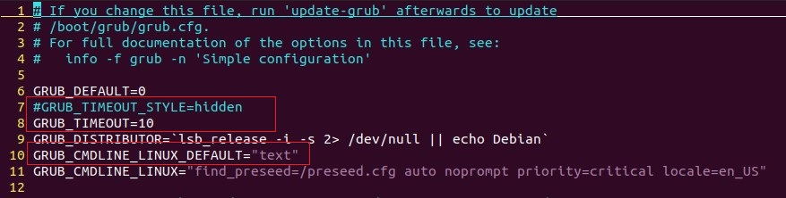
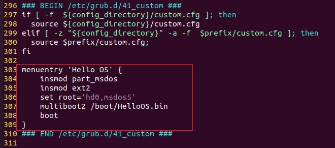

# Hello OS

### 1. 各文件内容

```
HelloOS
├── entry.asm -- 供GRUB调用的引导程序，设置CPU工作模式和C语言工作环境，并调用main函数
├── main.c    -- Hello OS入口函数
├── vgastr.c  -- 实现字符串在显示器上的输出
├── vgastr.h
├── hello.lds -- 链接脚本
└── Makefile
```

### 2. 编译Hello OS

##### 2.1 编译环境

```shell
sudo apt-get install make nasm gcc
```

##### 2.2 编译

```shell
$ make build

HelloOS
├── entry.asm
├── entry.o
├── main.c
├── main.o
├── vgastr.c
├── vgastr.h
└── vgastr.o
```

##### 2.3 链接

```shell
$ make link

HelloOS
├── entry.asm
├── entry.o
├── main.c
├── main.o
├── vgastr.c
├── vgastr.h
├── vgastr.o
├── hello.lds
├── HelloOS.elf -- ELF（Executable and Linkable Format，可执行和可链接）文件
└── HelloOS.map -- 内存映射布局
```

在Makefile中，链接生成HelloOS.elf时，使用了-Map选项：

`LDFLAGS		= -s -static -T hello.lds -n -Map HelloOS.map`

该选项使得在链接过程中，生成链接布局文件，通过该文件可知HelloOS的内存映射布局。

##### 2.4 生成Bin文件

```shell
$ make bin

HelloOS
├── entry.asm
├── entry.o
├── main.c
├── main.o
├── vgastr.c
├── vgastr.h
├── vgastr.o
├── hello.lds
├── HelloOS.elf
├── HelloOS.map
└── HelloOS.bin -- 二进制格式的可执行文件
```

### 3. 部署Hello OS

##### 3.1 实验环境

Vmware 16.0 Pro + Ubuntu 20.04

##### 3.2 设置GRUB进入引导菜单

HelloOS作为一个操作系统启动项供GRUB启动，因此需要能够在PC启动时进入GRUB引导菜单，并选择启动HelloOS。

**(1) 修改`/etc/default/grub`**

- 注释掉GRUB_TIMEOUT_STYLE=hidden
- GRUB_TIMEOUT=10（10s等待时间）
- GRUB_CMDLINE_LINUX_DEFAULT="text"

**(2) 更新GRUB配置**

```shell
$ sudo update-grub
```

##### 3.3 增加Hello OS启动项

**修改/boot/grub/grub.cfg**



- set root属性填写/boot/目录所在分区，使用命令 `df /boot/` 查看

```shell
$ df /boot/
Filesystem     1K-blocks    Used Available Use% Mounted on
/dev/sda5       50824704 8948496  39264752  19% /
```

- insmod加载模块，参考系统已有的启动项设置

##### 3.4 拷贝HelloOS.bin到/boot/目录下

```shell
$ sudo cp HelloOS.bin /boot/
```

##### 3.5 启动Hello OS

重启虚拟机，可见到Hello OS启动项。
